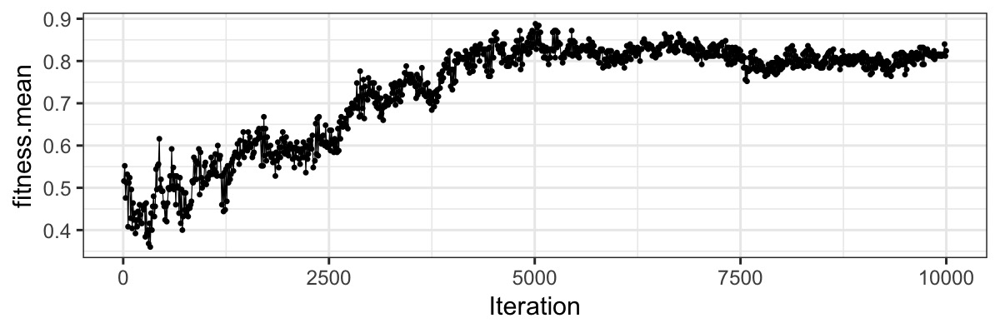
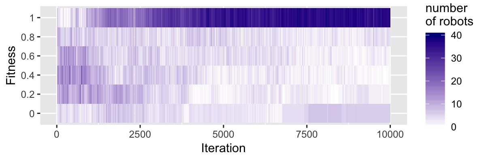
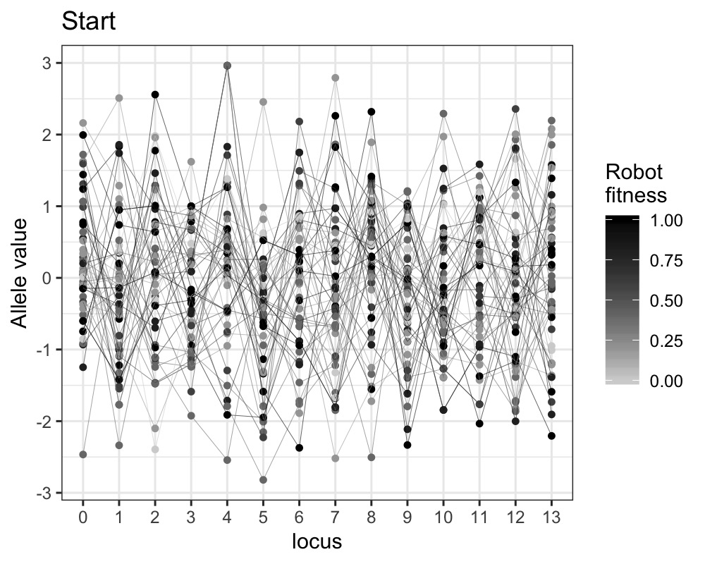
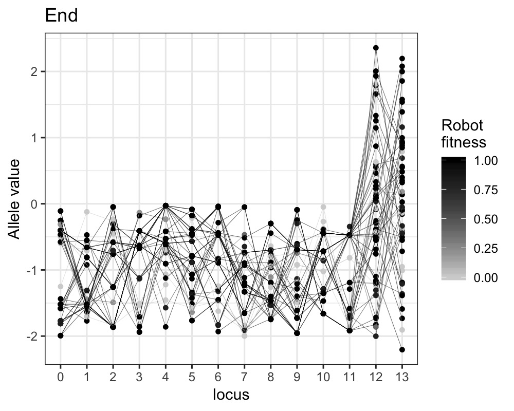
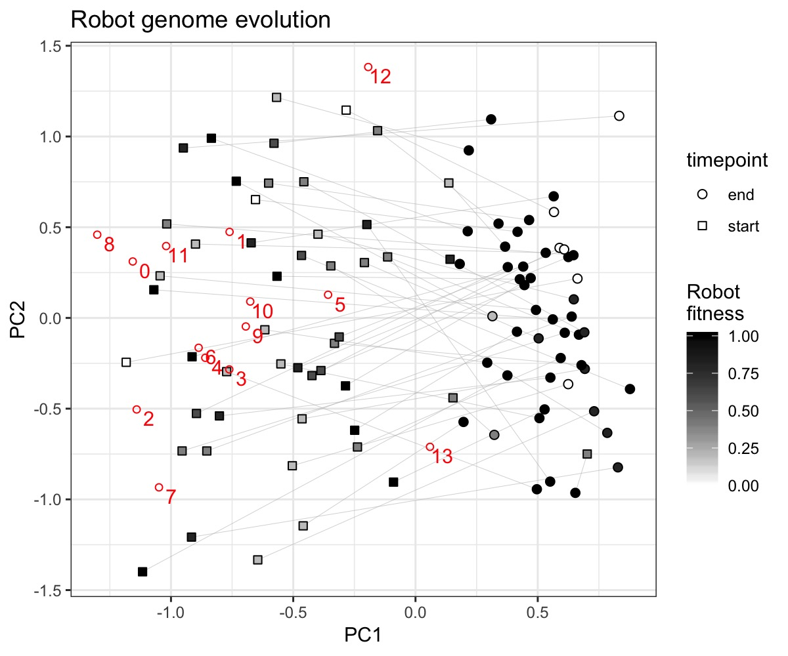
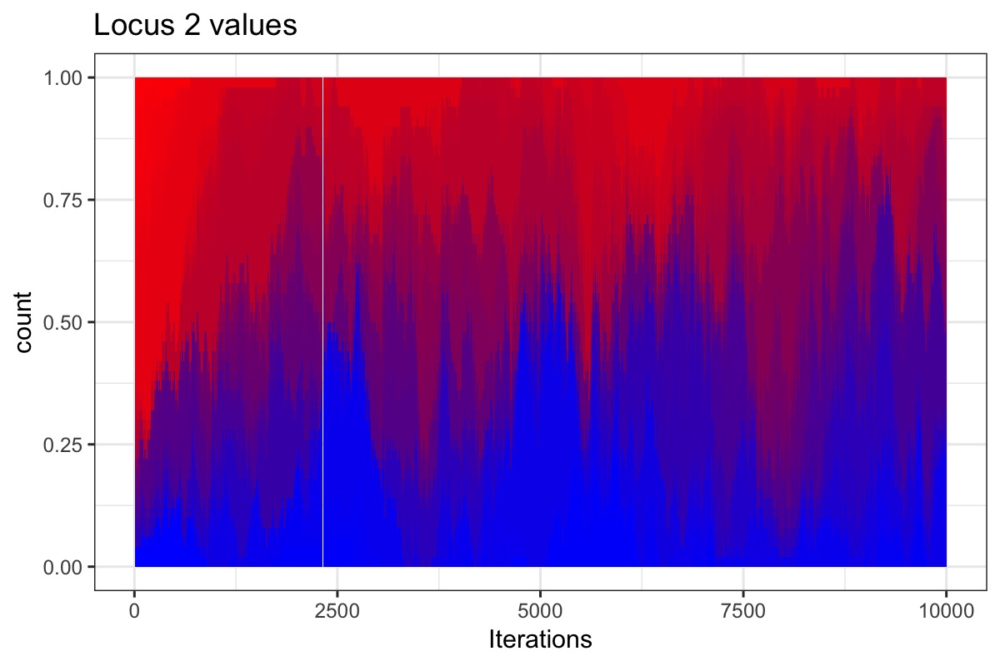
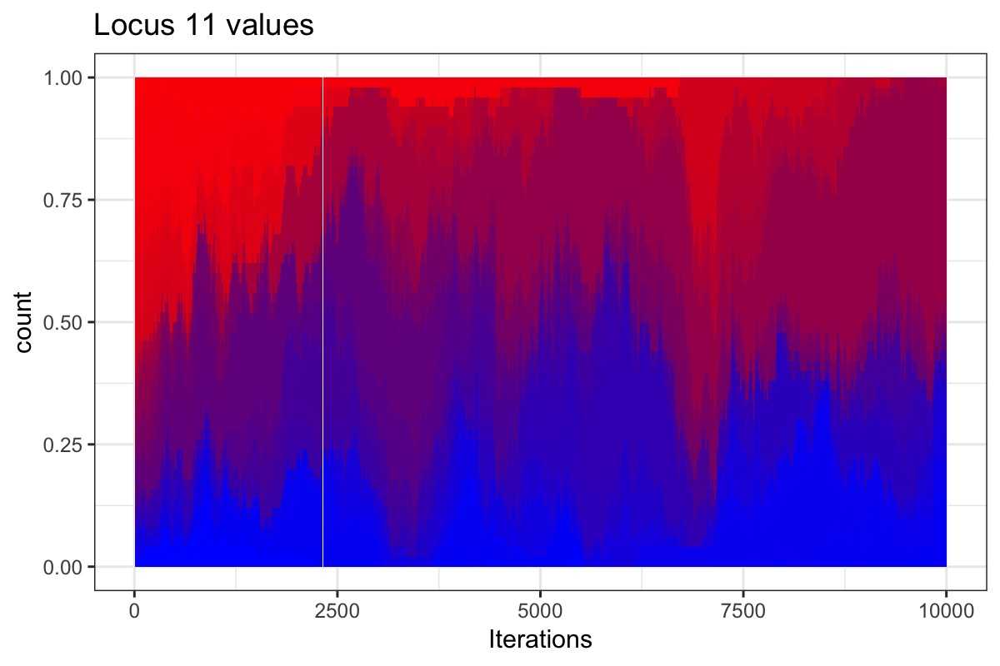
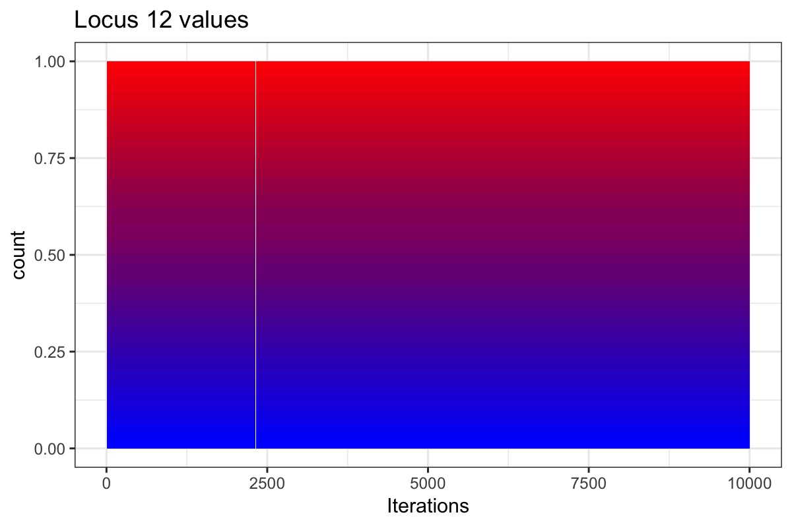
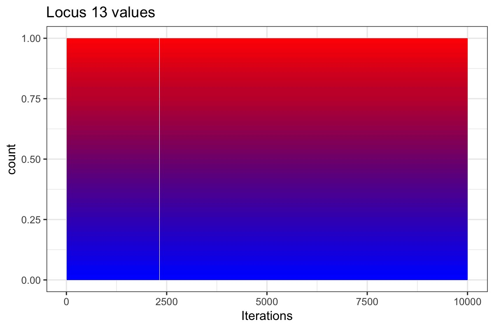

# Microbiobots: gene transfer and evolution in a genetically diverse robot swarm population #
**Team members:** Levi Fussell1, Kirtus Leyba2, Jessica A Lee3,4, and Anshuman Swain5

1School of Informatics, University of Edinburgh, UK;
2Biodesign Institute, Arizona State University, Tempe, AZ 85281, USA;
3Global Viral, San Francisco, CA 94104, USA;
4Biology Department, San Francisco State University, San Francisco, CA 94132, USA;
5Department of Biology, University of Maryland, College Park, MD 20742, USA;

## Introduction ##
Algorithms that implement information exchange and the optimization of computational processes find a particularly interesting use case in distributed, asynchronous systems with constraints on communication and computational capabilities. There are many instances where such challenges must be addressed, such as the consensus of values in networks with tenuous or even adversarial connections (Pasqualetti, Bicchi, & Bullo, 2011), or the coverage of an environment by mobile autonomous vehicles (Cortes, Martinez, Karatas, & Bullo, 2004). It has been shown that many distributed tasks can be unified as the optimization of a specialized form of a more fundamental cost function (Schwager, Rus, & Slotine, 2011). 

The coordination and collective behavior of simplistic robotic agents comes with the potential for robust, affordable, and adaptable systems. These challenges fall under the active research field of swarm robotics. Past work has shown that probabilistic models can be adapted to useful control schemes. For example, a swarm might effectively transport objects larger than any single member (Wilson et al., 2014). While not generally thought of as swarm robots, the related self-organizing particle systems have been shown to effectively optimize various cost functions to achieve a desired behavior even in completely distributed and asynchronous settings. Such behaviors include but are not limited to compression and expansion (Cannon, Daymude, Randall, & Richa, 2016), leader election (Daymude, Gmyr, Richa, Scheideler, & Strothmann, 2017), and universal coating (Daymude et al., 2018). 

These previous approaches are well suited to individual tasks, or being abstracted to larger related task classes. The design of an ideal system of a quickly adapting and robust robotic swarm that generalizes to multiple task classes is still a seemingly daunting problem. For some tasks, tools have been developed to adapt the behavior of the swarm to be specialized for specific environments. The ant inspired central-place foraging algorithm (CPFA) has been evolved with a genetic algorithm (GA) such that a robotic swarm performs with parameters suited to a specific environment, resource distribution, or environmental noise level (Hecker & Moses, 2015). The process of evolving entirely new behaviors instead of parameters of those behaviors is a difficult challenge, and whether such a method can be successful is still an open question. Biology-inspired optimization of machine behavior has been applied to other systems outside of robotics. Neural networks have successfully been evolved using genetic algorithms in the well-known NEAT project (Stanley & Miikkulainen, 2002). Furthermore, it has been shown that neural topologies could be effectively evolved in an approach that is agnostic to the weights of the neural networks (Gaier & Ha, 2019). Genetic algorithms that operate in a structured space have had success in certain problem cases (Nebro, Durillo, Luna, Dorronsoro, & Alba, 2009). A major challenge in this project is to design an effective evolutionary algorithm that operates in real-time and accounts for the distributed nature of the robot team. 

This project investigates the question of how a robot population with limited computational and communication capabilities can simultaneously optimize their individual performance and share effective behaviors with other robots. This challenge has many applications in robotics, such as pattern formation in swarms, rendezvous algorithms in localization and mapping, and convergence and consensus algorithms in distributed and noisy environments. We look to biology for inspiration to design a system that has several potentially useful traits. The robots are behaviorally heterogeneous, opening up the possibility of implicit task allocation in multi-task problems. The robots also optimize themselves via simulated evolution. Our approach must account for the fact that the robot population does not grow or decrease, which are important tools in biological evolution. Additionally, the system has redundancies because genetic patterns are mixed into the population, which may improve redundancy to robot failures or sensor error. 

In this work, we seek to explore such scenarios using inspiration from the biological phenomenon of horizontal gene transfer. Horizontal gene transfer (HGT) refers to the sharing of genetic material between organisms that are not in a parent–offspring relationship (where transmission of genes from parent to offspring is termed "vertical transmission") (Soucy, Huang, & Gogarten, 2015). Although HGT was originally discovered in the context of pathogenic microorganisms (Tatum & Lederberg, 1947), the scope of HGT extends far beyond disease-causing organisms (Soucy et al., 2015). It is a widely recognized mechanism for adaptation and evolution in prokaryotic organisms and is also responsible for many functions, innovations and transitions in eukaryotic organisms. In last few decades, methods to detect HGT have improved, and these have revealed the surprising extent and relevance of HGT to the variation of viral, prokaryotic and eukaryotic gene content (Soucy et al., 2015). Many major innovations and changes in genetic structure are now known to be the result of HGT, resulting in a ‘web of life’ rather than in a steadily bifurcating tree - which has brought about a major revision of understanding in evolutionary biology (Swithers, Soucy, & Gogarten, 2012). 

At the cellular scale, A wide variety of mechanisms of HGT are known: an organism may acquire novel genetic material from its surrounding environment, from infecting viruses, or from other cellular organisms through direct contact. In addition, HGT may consist of the adoption of plasmid DNA carrying several genes independently of the genome; it may result in the incorporation of the novel genetic material into random locations in the genome, or into HGT-prone "hotspots"; or it may result in replacement of existing genes with new alleles of the same genes via homologous recombination. At the eco-evolutionary scale, transfer probability among organisms can depend upon the niche or habitat that they inhabit - i.e. if they inhabit the same space then there is a higher chance of exchanging genes (Papke & Gogarten, 2012) - and organisms that are closely related phylogenetically also have an increased chance of exchanging genes successfully, though even distantly related organisms may have a non-zero chance (Williams, Gogarten, & Papke, 2012). We have taken inspiration from this phenomenon, which results in major evolutionary dynamics in biological systems, and abstracted the mechanism of information transfer between biological entities to robotic agents to examine its potential to contribute to robot swarm learning behavior for certain common tasks. Here, we simulate the evolution of robots with genomes consisting of very simple neural networks, and allow them to evolve toward solving a task by exchanging genes horizontally. The HGT method they use is most similar to that of microorganisms that exchange genes via conjugation and incorporate the genes into their genome through homologous recombination: that is, information transfer occurs only among individuals in close physical proximity, pieces of information are linked and certain pieces have higher probability of being exchanged together; and new information replaces old information in a designated location in the genome.

## Methods & model description ##
In this section, we will provide a brief overview of the system - explaining how the genes are represented in the robot, the control model for the robots, and how the robots interact to solve a task and share genetic information.

We initialize a robot population, , uniformly randomly, ![$p_{i,j} \sim \[-2,2\]$](https://render.githubusercontent.com/render/math?math=%24p_%7Bi%2Cj%7D%20%5Csim%20%5B-2%2C2%5D%24) for . The position of each robot is then assigned at random ![$x(\p_i) \sim \[0,1\]$, $y(\p_i) \sim \[0,1\]$](https://render.githubusercontent.com/render/math?math=%24x(%5Cp_i)%20%5Csim%20%5B0%2C1%5D%24%2C%20%24y(%5Cp_i)%20%5Csim%20%5B0%2C1%5D%24) (the bounds of the simulation are assumed in the range [0, 1]), and their velocity is set to zero %3Dv_y(p_i)%3D0%24). We refer to the vector pi of an individual as the ‘genome’ of a robot, each element in the vector as a ‘gene’ or ‘locus,’ and the value taken by the gene is an ‘allele.’ This genetic vector parameterizes the control model for each individual. We define the control policy of an individual as %7D%7C%5Cbm%7Bs%7D_i%5E%7B(t)%7D)%20%3A%20%5Cmathbb%7BS%7D%20%5Crightarrow%20%5Cmathbb%7BA%7D), which is a function that takes in an egocentric state of the robot at a certain time step %7D%20%5Cin%20%5Cmathbb%7BS%7D%24) and outputs an action for the it to perform %7D%24). For the simplest case,  performs a linear operator on the inputs, but the model could be non-linear.

The state of a robot, , is as follows: ![$s_i^{(t)} = \[x^{(t)}(p_k), y^{(t)}(p_k), v_x^{(t)}(p_k), v_y^{(t)}(p_k), s^{(t)}(p_k), b_k | \text{for k in }neighb(p_i)\]$](https://render.githubusercontent.com/render/math?math=%24s_i%5E%7B(t)%7D%20%3D%20%5Bx%5E%7B(t)%7D(p_k)%2C%20y%5E%7B(t)%7D(p_k)%2C%20v_x%5E%7B(t)%7D(p_k)%2C%20v_y%5E%7B(t)%7D(p_k)%2C%20s%5E%7B(t)%7D(p_k)%2C%20b_k%20%7C%20%5Ctext%7Bfor%20k%20in%20%7Dneighb(p_i)%5D%24) where x,y are position functions,  are velocity functions, and %24) returns the neighbors in the vicinity of the robot; if the number of neighbors falls short of the maximum number of neighbors, the empty positions in the state vector are filled with zeros.  is an indicator variable for when a robot is present in the state vector.

The action of a robot,  is ![$a_i^{(t)} = \[|v|_i, \omega_i\]$](https://render.githubusercontent.com/render/math?math=%24a_i%5E%7B(t)%7D%20%3D%20%5B%7Cv%7C_i%2C%20%5Comega_i%5D%24), where  and  are the speed and angular velocity of the robot. During run time, the robots cannot exceed  and , and a small amount of friction is used to slow them down if they do not actuate.

The goal of a robot is called the fitness function and is defined at the individual level as ![$f_i : \mathbb{S}^N \rightarrow \[0,1\]$](https://render.githubusercontent.com/render/math?math=%24f_i%20%3A%20%5Cmathbb%7BS%7D%5EN%20%5Crightarrow%20%5B0%2C1%5D%24), so that it is a function of the states of all the robots. Our aim is to maximize the fitness of all the individuals in .

A robot passes genetic material to another robot via the horizontal gene transfer (HTG) algorithm. HTG is done every  timesteps, and some robots select an individual %24) uniformly at random. Then a gene subsequence %20%3D%20p%5E(%7Bl%3A(l%2Bm)%7D)_i%24) is chosen where ![$l \sim \[0, H-k\]$](https://render.githubusercontent.com/render/math?math=%24l%20%5Csim%20%5B0%2C%20H-k%5D%24) and  is a subsequence size chosen from some predefined range. Note that %24) indicates splicing operation of an array. This subsequence is then inserted into  at the index , replacing the elements of the array in %24) such that %7D)_k%20%3D%20q(p_i)%24). The robots that perform HTG are selected in the same way individuals are selected in genetic algorithms (GAs), so there are a range of methods to choose from. For now, we settle on using fitness-proportional selection.

## Experiments ##

Here we present the results of our initial experiment with this model system: a swarm aggregation task (Bayındır, 2016) - a classic task in swarm robotics. We discuss the results of a single evolution experiment, but these results are typical and reproducible. We examined not only the evolution of the system as a whole and its ability to perform task at the population (swarm) level, but also the evolutionary dynamics of the individuals and their genomes, using methods from ecology and population genetics. Note that there are some key differences between this system and a typical biological system: robots are ’immortal,’ and the population size does not change.

## Results and Discussion ##
### Robot swarm performance ###
Our robot population evolved successfully toward increased fitness: mean fitness of the group reached a value of approximately 0.8 after 5,000 iterations and remained at that plateau (Fig. 1) Robot fitness is defined on the basis of the robot’s performance at the aggregation task; More formally, the fitness function for aggregation is, -x(p_i))%5E2%20%2B%20(y(p_j)-y(p_i))%5E2)%24) ) and can be interpreted as the normalized number of neighbors that a robot has.

**Figure 1**: Average values of robot fitness in the population over time.

While the population average fitness never increased above 0.9, the population contained a majority of individuals with fitness of 1.0; however, there were also some individuals with lower fitness, including several that reached a fitness value of 0 and never improved (Fig. 2). This result highlights one key weakness of our system: because gene exchange is linked with physical proximity, and physical proximity is the very task that determines fitness, there is a positive feedback between fitness and information exchange. Robots that fail to get close to neighbors lose the opportunity to gain genes that will improve their ability to get close to neighbors, and thus are left alone and isolated from the swarm.

**Figure 2**: Distribution of fitness values across the population shown as a heatmap, where color indicates the abundance of robots with a given fitness value. Note that fitness only ever takes values of 0, 0.2 0.4, 0.6, 0.8, or 1.

### Genome dynamics ###
Because genes in our system represent weights in a neural network, they take numeric values (in contrast to biological genes, which code for proteins and - for the most part - cannot be considered quantitative). At the outset of the study we did not know what values to expect at each gene to take in an evolved population, and how evolutionary trajectories would differ among the different genes. Fig. 3 shows the values of genes at the beginning and end of evolution. At the start of the simulation, alleles were assigned randomly, evenly distributed between -3 and 3. We found that by the end of evolution, most genes had evolved toward negative values. There is little difference among the values taken by the different genes (though we have not yet done extensive statistical analyses). Note also that some allele values have many lines going through them, indicating that some alleles are present in many robots - likely the result of gene exchange among robots. One clear exception to these observations is at genes 12 and 13; these two genes do not show any change after evolution. Gene locus 12 refers to the binary value indicating whether a robot is present in the sensor. Therefore, test case that we are using has the robots always interacting and their neighborhood always contains the maximum number of robots, which may explain the lack of selection or exchange at that gene. Locus 13 is the bias associated with the velocity of the robot; it is possible that there is no selection on this gene because robot velocity is always at maximum velocity.

**Figure 3**: Allele values (y-axis) at each locus in the genome (x-axis), at the start of the simulation (left) and the end of the simulation (right). Each point represents one robot, color-coded by the fitness of the robot; points belonging to the same robot are connected by lines.

We used principal components analysis to visualize the changes in robot genomes between the beginning and end of evolution, relative to individual genes 4. In agreement with Figure 3, at the start of the simulation, all gene values are evenly distributed and neither they nor the robots cluster significantly. The first principle component seems to be associated with the change, over evolution, toward lower values for loci 0-11 (robot points have moved away from the locus points). The second principle component is spanned by the distance between genes 12 and locus 13. Note also that at the end, there are still no clusters among the robots. That is, we do not observe "species" that have high similarity in their genomes; every robot is approximately equally genetically similar to every other robot, and genome content does not explain fitness in the robots that have low fitness values. Furthermore, there are no robots that have particularly extreme values at any particular gene locus.

**Figure 4**: Biplot showing principal components analysis of robots and their genes at start and end of evolution. Each shaded point represents one robot, with shape representing start (squares) or end (circles), and shading indicating fitness. Each open red circle represents one locus, labeled by its locus number. Axes PC1 and PC2 explain 28.7 \% and 12.4 \% of the variance, respectively.

To visualize the changes in allele abundance during the entire course of evolution, we generated plots showing the diversity of each allele at a given gene locus over time. Fig. 5 shows Locus 2 and Locus 11 as examples. Each allele is shown as a different color, indicating its numeric value. Evident from these plots is that low values increase in abundance between end and beginning, but there remains substantial diversity in the population at the end – it is not dominated by a small number of alleles. Fig. 6 show loci 12 and 13 for contrast, where gene exchange among robots does not appear to occur, although it is possible that mutation does.

**Figure 5**: Stacked bar charts showing allele diversity at locus 2 (top) and locus 11 (bottom) over time. These loci were chosen only because they happen to be pretty typical. Each shade represents a different value, or "allele," at that locus, with color indicating the value of the allele (dark blue is low, toward -3, and red is high, toward 3; but note that the scale is centered on the central value of the full dataset, so the center of the scale is <0). For plotting purposes, allele values were rounded to the nearest 0.01, so that there are only ~50 different alleles observed for any locus.

**Figure 6**: Plots similar to those for the previous figure, but for loci 12 and 13.

## Future Work ##
Our plans for future work on this system include: 
1. Statistical analysis on multiple replicate runs of the model, which may offer better insight into the differences in function and evolution among different genes 
2. Testing the effect of modifications to the evolutionary process, such as the fitness requirements for gene exchange, the rules governing which neighbors may exchange genes, and how mutation happens 
3. Introducing new tasks for the swarm to solve 
4. Testing the ability for a trained robot swarm to solve novel tasks 
5. Evaluating the value of diversity in the swarm: are all genotypes interchangeable in their ability to contribute to the overall performance of the swarm? 

We aim to use this system not only to address challenges in evolutionary swarm robotics but also to study evolution in a novel artificial life system.

## Acknowledgements ##
We would like to thank Santa Fe Institute (SFI) for helping us come together and work on this project at the Complex Systems Summer School (CSSS) 2019.

## Hands-on ##
If you want to run these experiments by yourself, the complete code is available on this repository. Below is a detailed description of how to do it. Please feel to reach out to us if you need any help.

### Dependencies ###
Some dependencies are needed. If you have a python environment setup, you can just do:

`pip install numpy`  
`pip install pygame`

### Petri Dish ###

An example of an experiment is found in 'examplePetriA.py'. Each of the parameters is explained in the file 'PetriDish.py' at the header of the PetriDish class. To start a new experiment, copy the layout of the 'examplePetriA.py' file and make sure you define a unique 'nametag' for the experiment.

You will also want to make your own custom HTG Method which defines how genes are selected within a robot. New methods should be added to the 'HTGmethods.py' file and imported into your petri dish example file. 

### Running An Experiment ###

* Move mouse over a robot to display its ID number and position.
* Data is saved in the '/outputs' directory as a '.csv' file, with a file name similar to your experiment name.

## References ##

1. Bayındır, L. (2016). A review of swarm robotics tasks. Neurocomputing, 172 , 292–321. 
2. Cannon, S., Daymude, J. J., Randall, D., & Richa, A. W. (2016). A markov chain algorithm for compression in self-organizing particle systems. In Proceedings of the 2016 acm symposium on principles of distributed computing (pp. 279–288). 
3. Cortes, J., Martinez, S., Karatas, T., & Bullo, F. (2004). Coverage control for mobile sensing networks. IEEE Transactions on robotics and Automation, 20 (2), 243–255. 
4. Daymude, J. J., Derakhshandeh, Z., Gmyr, R., Porter, A., Richa, A. W., Scheideler, C., & Strothmann, T. (2018). On the runtime of universal coating for programmable matter. Natural Computing, 17 (1), 81–96. 
5. Daymude, J. J., Gmyr, R., Richa, A. W., Scheideler, C., & Strothmann, T. (2017). Improved leader election for self-organizing programmable matter. In International symposium on algorithms and experiments for sensor systems, wireless networks and distributed robotics (pp. 127–140). 
6. Gaier, A., & Ha, D. (2019). Weight agnostic neural networks. arXiv preprint arXiv:1906.04358 . 
7. Hecker, J. P., & Moses, M. E. (2015). Beyond pheromones: evolving error-tolerant, flexible, and scalable ant-inspired robot swarms. Swarm Intelligence, 9 (1), 43–70.
8. Nebro, A. J., Durillo, J. J., Luna, F., Dorronsoro, B., & Alba, E. (2009). Mocell: A cellular genetic algorithm for multiobjective optimization. International Journal of Intelligent Systems, 24 (7), 726–746. 
9. Papke, R. T., & Gogarten, J. P. (2012). How bacterial lineages emerge. Science, 336 (6077), 45–46. 
10. Pasqualetti, F., Bicchi, A., & Bullo, F. (2011). Consensus computation in unreliable networks: A system theoretic approach. IEEE Transactions on Automatic Control, 57 (1), 90–104. 
11. Schwager, M., Rus, D., & Slotine, J.-J. (2011). Unifying geometric, probabilistic, and potential field approaches to multi-robot deployment. The International Journal of Robotics Research, 30 (3), 371– 383. 
12. Soucy, S. M., Huang, J., & Gogarten, J. P. (2015). Horizontal gene transfer: building the web of life. Nature Reviews Genetics, 16 (8), 472–482. 
13. Stanley, K. O., & Miikkulainen, R. (2002). Evolving neural networks through augmenting topologies. Evolutionary computation, 10 (2), 99–127. 
14. Swithers, K. S., Soucy, S. M., & Gogarten, J. P. (2012). The role of reticulate evolution in creating innovation and complexity. International journal of evolutionary biology, 2012 . 
15. Tatum, E., & Lederberg, J. (1947). Gene recombination in the bacterium escherichia coli. Journal of bacteriology, 53 (6), 673. 
16. Williams, D., Gogarten, J. P., & Papke, R. T. (2012). Quantifying homologous replacement of loci between haloarchaeal species. Genome biology and evolution, 4 (12), 1223–1244. 
17. Wilson, S., Pavlic, T. P., Kumar, G. P., Buffin, A., Pratt, S. C., & Berman, S. (2014). Design of antinspired stochastic control policies for collective transport by robotic swarms. Swarm Intelligence, 8 (4), 303–327.

