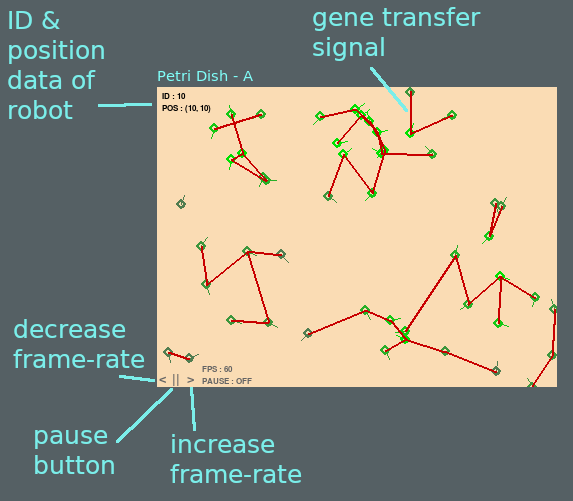

# HTG Robotics #

Robotic horizontal gene transfer simulation. Here's how to run an experiment.

## Dependencies ##

Some dependencies are needed. If you have a python environment setup, you can just do:

`pip install numpy`  
`pip install pygame`

## Petri Dish ##

An example of an experiment is found in 'examplePetriA.py'. Each of the parameters is explained in the file 'PetriDish.py' at the header of the PetriDish class. To start a new experiment, copy the layout of the 'examplePetriA.py' file and make sure you define a unique 'nametag' for the experiment.

You will also want to make your own custom HTG Method which defines how genes are selected within a robot. New methods should be added to the 'HTGmethods.py' file and imported into your petri dish example file. 

## Running An Experiment ##

* Move mouse over a robot to display its ID number and position.
* Data is saved in the '/outputs' directory as a '.csv' file, with a file name similar to your experiment name.

## Working Features ##

TODO features:

1. <del> Fitness function incorporation. </del>
2. Recording/Saving data for gene transfers (see 'DataMethods.py').
3. <del> Fitness-dependent gene-transfer. </del>
4. Fitness-proportional gene-selection (see 'HTGmethods.py').
5. It's very inefficient in python to have each robot be its own class object if we want to perform operations on groups of individuals. Create a population class which tracks the parameters of the population in vectors to make use on NumPy.
6. Make it clear that 'selectGeneSpacialCorrelation' is not a usable gene transfer method.
